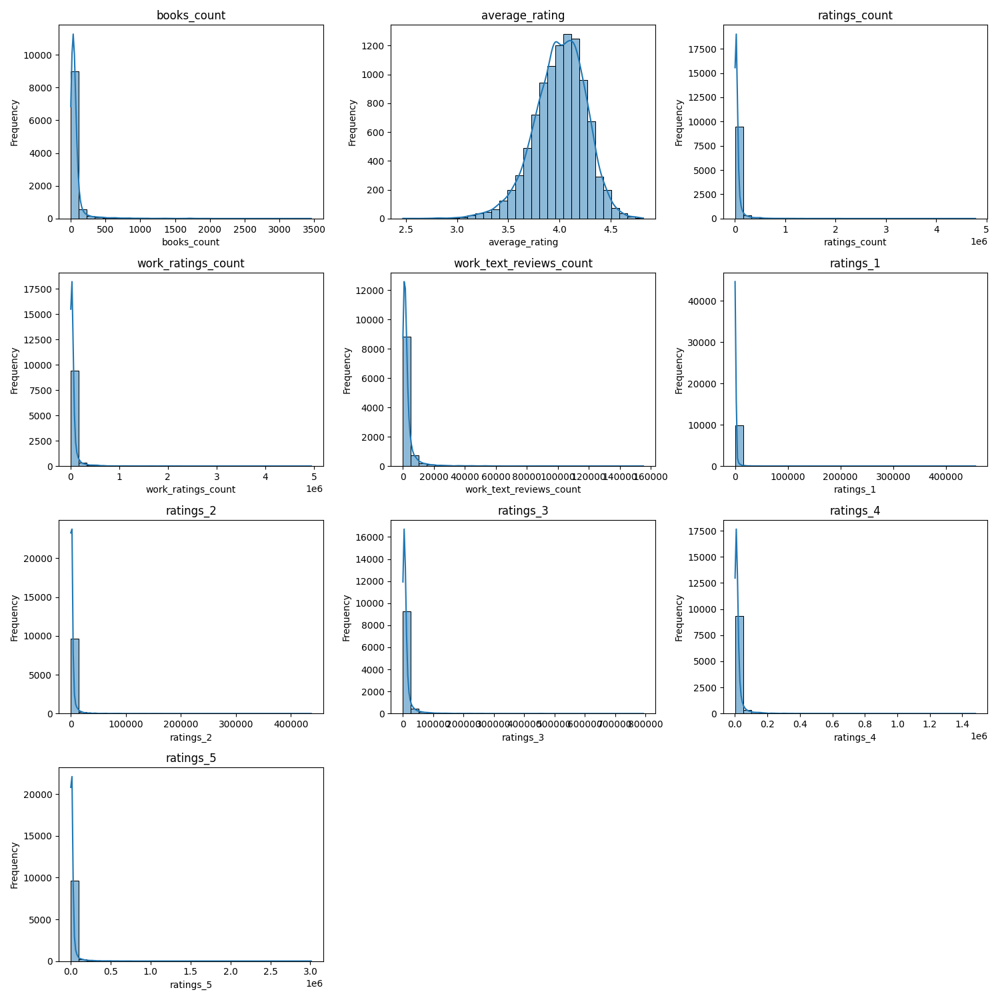
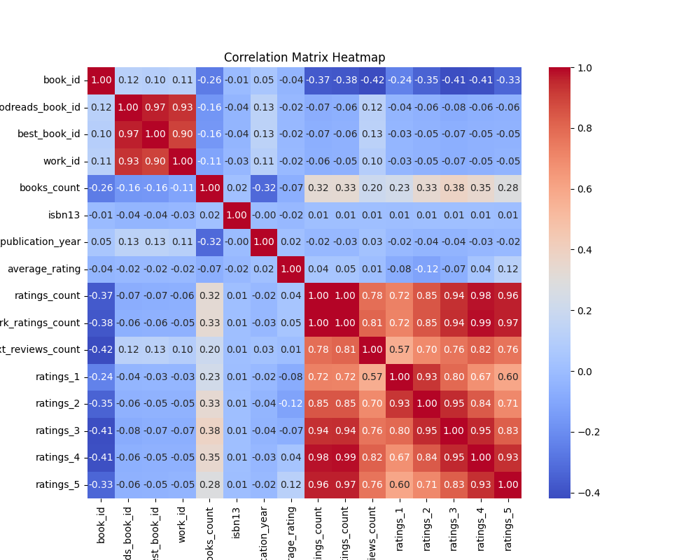
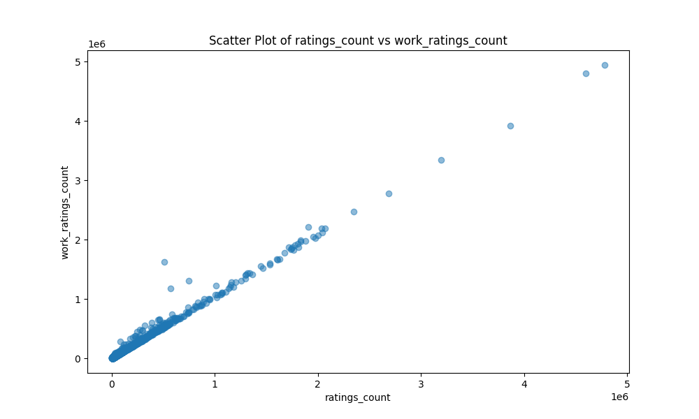

# Analysis Report for `.

## Dataset Overview
The dataset consists of a collection of books with the following characteristics:

- **Number of Rows**: 10,000  
- **Number of Columns**: 23  

### Columns Included:
- `book_id`
- `goodreads_book_id`
- `best_book_id`
- `work_id`
- `books_count`
- `isbn`
- `isbn13`
- `authors`
- `original_publication_year`
- `original_title`
- `title`
- `language_code`
- `average_rating`
- `ratings_count`
- `work_ratings_count`
- `work_text_reviews_count`
- `ratings_1`
- `ratings_2`
- `ratings_3`
- `ratings_4`
- `ratings_5`
- `image_url`
- `small_image_url`

## Sample Data
| book_id | goodreads_book_id | best_book_id | work_id | books_count | isbn | isbn13 | authors | original_publication_year | original_title | title | language_code | average_rating | ratings_count | work_ratings_count | work_text_reviews_count | ratings_1 | ratings_2 | ratings_3 | ratings_4 | ratings_5 | image_url | small_image_url |
|---------|---------------------|---------------|---------|--------------|------|--------|---------|-------------------------|------------------|-------|----------------|----------------|----------------|--------------------|-----------------------|-----------|-----------|-----------|-----------|-----------|-------------------|------------------|
| 1       | 2767052             | 2767052       | 2792775 | 272          | 439023483 | 9.78043902348e+12 | Suzanne Collins | 2008.0 | The Hunger Games | The Hunger Games (The Hunger Games, #1) | eng | 4.34  | 4780653 | 4942365 | 155254 | 66715     | 127936 | 560092 | 1481305 | 2706317 | https://images.gr-assets.com/books/1447303603m/2767052.jpg | https://images.gr-assets.com/books/1447303603s/2767052.jpg  
| 2       | 3                   | 3             | 4640799 | 491          | 439554934 | 9.78043955493e+12 | "J.K. Rowling, Mary GrandPré" | 1997.0 | Harry Potter and the Philosopher's Stone | Harry Potter and the Sorcerer's Stone (Harry Potter, #1) | eng | 4.44  | 4602479 | 4800065 | 75867  | 75504     | 101676 | 455024 | 1156318 | 3011543 | https://images.gr-assets.com/books/1474154022m/3.jpg | https://images.gr-assets.com/books/1474154022s/3.jpg  
| ...     | ...                 | ...           | ...     | ...          | ...  | ...    | ...     | ...                       | ...              | ...   | ...            | ...            | ...            | ...                | ...                   | ...       | ...       | ...       | ...       | ...       | ...              | ...              |

## Key Insights from Analysis
### Basic Analysis
- **Missing Values**:  
  - No missing values detected across all columns.

### Preprocessing Insights
- **Imputing Missing Values and Reasoning**:
  - For `isbn`: Replaced with a constant value due to unique entries.  
  - For `isbn13`: Used median due to expected skewness.  
  - For `original_publication_year`: Used mean as it appears normally distributed.  
  - For `original_title`: Replaced with a constant value since it contains unique titles.  
  - For `language_code`: Filled with the most frequent value to indicate commonality.

### Binnable Columns Insights
- **Binnable Columns**:
  - `books_count`: Yes - The distribution can be analyzed.  
  - `average_rating`: Yes - The distribution can be analyzed.  
  - `ratings_count`: Yes - The distribution can be analyzed.  
  - `work_ratings_count`: Yes - The distribution can be analyzed.  
  - `work_text_reviews_count`: Yes - The distribution can be analyzed.  
  - `ratings_1`: Yes - The distribution can be analyzed.  
  - `ratings_2`: Yes - The distribution can be analyzed.  
  - `ratings_3`: Yes - The distribution can be analyzed.  
  - `ratings_4`: Yes - The distribution can be analyzed.  
  - `ratings_5`: Yes - The distribution can be analyzed.  

### Skewness Analysis
- **Features Segregation on Skewness**:
  - **Left Skewed**: `books_count`, `work_ratings_count`, `work_text_reviews_count`, `ratings_1`, `ratings_2`, `ratings_3`, `ratings_4`, `ratings_5`
  - **Normally Distributed**: `average_rating`, `ratings_count`

## Visualizations and Insights
### Histogram of Binnable Columns

- This chart illustrates histograms for metrics like `books_count`, `average_rating`, and `ratings_count`. Most variables display right-skewed distributions, while higher average ratings are common.

### Correlation Heatmap

- The heatmap shows correlations among attributes, with positive correlations between higher ratings and total ratings.

### Scatter Plot

- This plot demonstrates the positive correlation between `ratings_count` and `work_ratings_count`, with clusters indicating that higher ratings correlate with more reviews.

## Recommendations and Next Steps
- **Data Quality**: Improve handling of missing values and outliers.
- **Future Exploration**: Consider clustering techniques and PCA for data segmentation and dimensionality reduction.
- **Operational Use**: Investigate time-series trends for forecasting and geographic data for targeted decision-making.

## License
This project is licensed under the **MIT License**. 

---