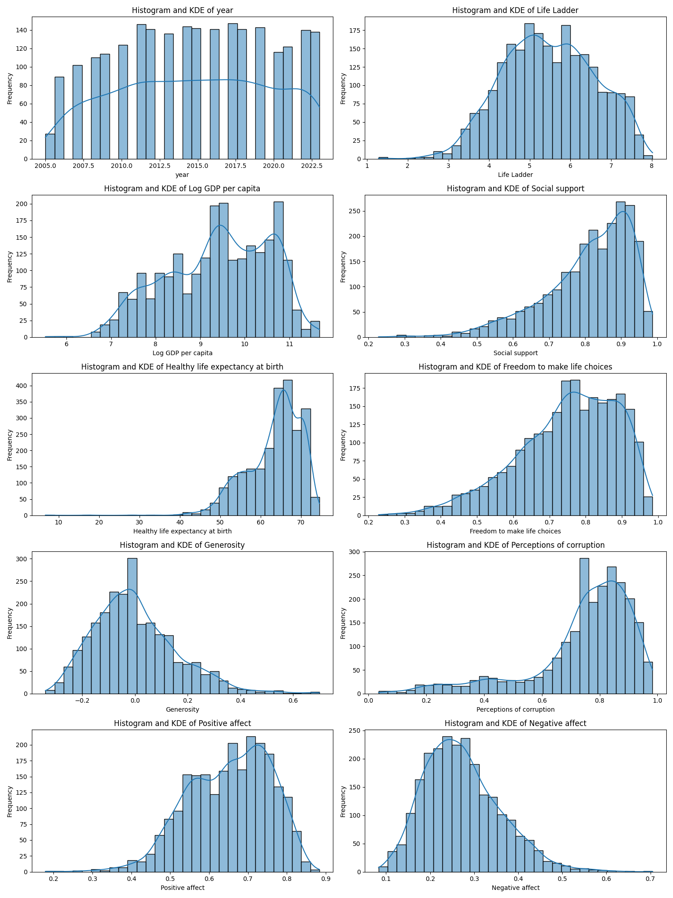
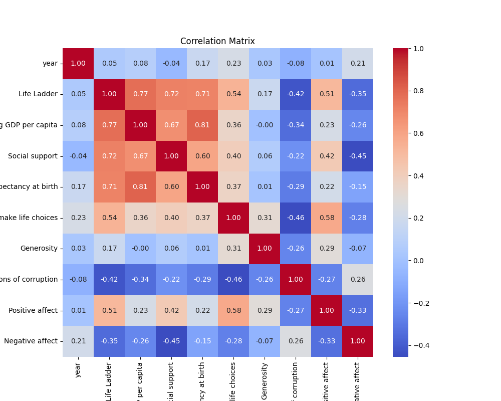
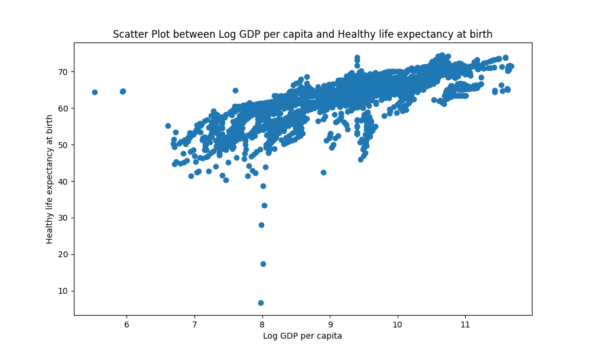

# Happiness Analysis Report

## Overview
This report analyzes a dataset tracking various factors contributing to happiness and well-being across different countries and years. The focus is on multiple indicators such as GDP, social support, life expectancy, and perceptions of corruption.

### Dataset Overview
- **Total Records**: 2363  
- **Total Features**: 11  
- **Feature List**:  
  - `Country name`  
  - `year`  
  - `Life Ladder`  
  - `Log GDP per capita`  
  - `Social support`  
  - `Healthy life expectancy at birth`  
  - `Freedom to make life choices`  
  - `Generosity`  
  - `Perceptions of corruption`  
  - `Positive affect`  
  - `Negative affect`  

## Sample Data
| Country name | year | Life Ladder | Log GDP per capita | Social support | Healthy life expectancy at birth | Freedom to make life choices | Generosity | Perceptions of corruption | Positive affect | Negative affect |
| ------------ | ---- | ----------- | ------------------ | -------------- | ------------------------------ | --------------------------- | ---------- | ------------------------ | ---------------- | ---------------- |
| Afghanistan  | 2008 | 3.724       | 7.350              | 0.451          | 50.500                         | 0.718                      | 0.164      | 0.882                  | 0.414            | 0.258            |
| Afghanistan  | 2009 | 4.402       | 7.509              | 0.552          | 50.800                         | 0.679                      | 0.187      | 0.850                  | 0.481            | 0.237            |
| Afghanistan  | 2010 | 4.758       | 7.614              | 0.539          | 51.100                         | 0.600                      | 0.118      | 0.707                  | 0.517            | 0.275            |
| ...          | ...  | ...         | ...                | ...            | ...                            | ...                       | ...        | ...                    | ...              | ...              |

## Key Insights from Analysis

### Basic Analysis
- **Missing Values Summary**:  
  {'Country name': 0, 'year': 0, 'Life Ladder': 0, 'Log GDP per capita': 0, 'Social support': 0, 'Healthy life expectancy at birth': 0, 'Freedom to make life choices': 0, 'Generosity': 0, 'Perceptions of corruption': 0, 'Positive affect': 0, 'Negative affect': 0}

### Preprocessing Insights
- **Imputation Strategies**:  
  - `Log GDP per capita`: replaced with **mean**.  
  - `Social support`: replaced with **mean**.  
  - `Healthy life expectancy at birth`: replaced with **mean**.  
  - `Freedom to make life choices`: replaced with **mean**.  
  - `Generosity`: replaced with **0**.  
  - `Perceptions of corruption`: replaced with **mean**.  
  - `Positive affect`: replaced with **mean**.  
  - `Negative affect`: replaced with **mean**.

### Binnable Columns Insights
- **Identified Binnable Columns**:  
  - `year`  
  - `Life Ladder`  
  - `Log GDP per capita`  
  - `Social support`  
  - `Healthy life expectancy at birth`  
  - `Freedom to make life choices`  
  - `Generosity`  
  - `Perceptions of corruption`  
  - `Positive affect`  
  - `Negative affect`

### Skewness Analysis
- **Feature Segregation Based on Skewness**:  
  - **Left-Skewed**: `Log GDP per capita`, `Healthy life expectancy at birth`, `Generosity`, `Perceptions of corruption`, `Positive affect`.  
  - **Right-Skewed**: `Life Ladder`, `Social support`, `Freedom to make life choices`, `Negative affect`.  
  - **Normally Distributed**: `year`.

## Visualizations and Insights

### Histograms and Density Estimates

- **Description**: This charts a grid of histograms and Kernel Density Estimate (KDE) plots for various attributes.  
- **Insights**:  
  1. Year distribution shows uniformity across the observed period.  
  2. GDP shows right-skewness indicating higher frequencies in lower GDP categories.  
  3. Life expectancy appears positively skewed.  
  4. Generosity shows a bimodal pattern.  
  5. Positive affect is slightly right-skewed.  
  6. Notable correlation is observed between Life Ladder and social support.  
  7. Perceptions of corruption trend toward higher perceived corruption.

### Correlation Matrix

- **Description**: Displays correlation coefficients between multiple variables.  
- **Insights**:  
  1. Highest correlation (0.77) is between GDP per capita and life satisfaction.  
  2. Social support has a significant correlation (0.61) with life satisfaction.  
  3. Healthy life expectancy also correlates notably (0.60) with happiness.  
  4. Generosity shows a smaller positive correlation (0.36) with life satisfaction.  
  5. Negative correlation (-0.46) exists between corruption perception and life satisfaction.  
  6. Positive affect and life satisfaction correlate at 0.33.

### GDP vs Life Expectancy Scatter Plot

- **Description**: Illustrates the relationship between Log GDP per capita and Healthy life expectancy at birth.  
- **Insights**:  
  1. Positive correlation indicates higher GDP is usually linked with longer life expectancy.  
  2. Some outliers suggest health factors beyond GDP influence longevity.  
  3. The relationship shows saturation at higher GDP values.  
  4. Data densely clusters at higher values for both GDP and life expectancy.

## Recommendations and Next Steps
- **Data Quality Improvement**: Prioritize addressing missing values and identifying outliers.  
- **Future Analysis**: Consider employing clustering and PCA for deeper insights.  
- **Operational Strategies**: Use time-series trends for forecasting and geospatial patterns to make informed decisions.

## License
MIT License