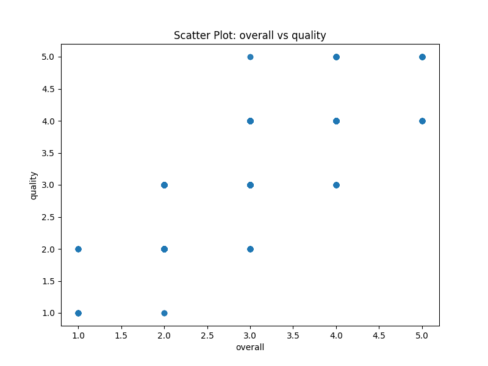

# Analysis Report for `./media`

## Dataset Overview
- **Number of Rows**: 2652
- **Number of Columns**: 8  
- **Columns**:  
  - `date`  
  - `language`  
  - `type`  
  - `title`  
  - `by`  
  - `overall`  
  - `quality`  
  - `repeatability`  

## Sample Data
| date       | language | type  | title                            | by                      | overall | quality | repeatability |
|------------|----------|-------|----------------------------------|------------------------|---------|---------|---------------|
| 15-Nov-24  | Tamil    | movie | Meiyazhagan                      | Arvind Swamy, Karthi   | 4       | 5       | 1             |
| 10-Nov-24  | Tamil    | movie | Vettaiyan                       | Rajnikanth, Fahad Fazil | 2       | 2       | 1             |
| 09-Nov-24  | Tamil    | movie | Amaran                          | Siva Karthikeyan, Sai Pallavi | 4       | 4       | 1             |
| 11-Oct-24  | Telugu   | movie | Kushi                           | Vijay Devarakonda, Samantha | 3       | 3       | 1             |
| 05-Oct-24  | Tamil    | movie | GOAT                            | Vijay                  | 3       | 3       | 1             |
| 02-Oct-24  | Telugu   | movie | Sanivaaram Saripodhaa          | Nani, SJ Surya         | 3       | 3       | 1             |
| 01-Oct-24  | Tamil    | movie | Saba Nayagan                   | Ashok Selvan           | 3       | 3       | 2             |
| 30-Sep-24  | English   | movie | Dune: Part Two                 | Timothée Chalamet, Zendaya  | 3       | 4       | 1             |
| 10-Sep-24  | English   | movie | Spencer Confidential             | Mark Wahlberg          | 3       | 3       | 1             |

## Key Insights from Analysis

### Basic Analysis
- **Missing Values**:  
```json
{'date': 0, 'language': 0, 'type': 0, 'title': 0, 'by': 0, 'overall': 0, 'quality': 0, 'repeatability': 0}
```

### Preprocessing Insights
- **Imputing Missing Values and Reasoning**:  
  - **`date`**: Replace with **median** to mitigate the influence of outliers.  
  - **`by`**: Replace with **most frequent** to preserve the mode of categorical data.

### Binnable Columns Insights
- **Binnable Columns and Reasoning**:  
  - **`overall`**: Binnable due to distinct categories.  
  - **`quality`**: Binnable due to distinct categories.  
  - **`repeatability`**: Binnable due to distinct categories.  

### Skewness Category
- **Features Segregation on Skewness**:  
  - **Left Skewed**: `repeatability`  
  - **Right Skewed**: `overall`, `quality`  
  - **Normally Distributed**: None  

## Visualizations and Insights

### Distribution of Ratings

- **Description**: The chart shows the distributions for Overall Ratings, Quality Ratings, and Repeatability Ratings across their respective ranges, with histograms and kernel density estimates displayed.
- **Insights**:  
  1. **Overall Ratings**: Multiple peaks suggest varied opinions, with a prominent peak around 3.5-4.0.  
  2. **Quality Ratings**: Similar to Overall Ratings, showing peaks around 3.5.  
  3. **Repeatability Ratings**: Clustered around 1.5, suggesting a consensus that repeatability is below average.

### Correlation Matrix

- **Description**: A heatmap illustrating correlations among `overall`, `quality`, and `repeatability`.
- **Insights**:  
  1. Strong correlation (0.83) between `overall` and `quality`.  
  2. Moderate correlation (0.51) between `overall` and `repeatability`.  
  3. Lower correlation (0.31) between `quality` and `repeatability`.

### Scatter Plot

- **Description**: Scatter plot showing the relationship between `overall` and `quality` ratings.
- **Insights**:  
  1. Points are dispersed, indicating a weak correlation between overall and quality scores.  
  2. High overall scores exist alongside varying quality assessments.  
  3. Varied quality perceptions among lower overall scores.

## Recommendations and Next Steps
- **Data Quality**: Address missing values and outliers for cleaner analysis.
- **Future Exploration**: Use clustering and PCA insights for segmentation and dimensionality reduction.
- **Operational Use**: Leverage time-series patterns for forecasting and geospatial trends for targeted decision-making.

## License
This project is licensed under the MIT License.